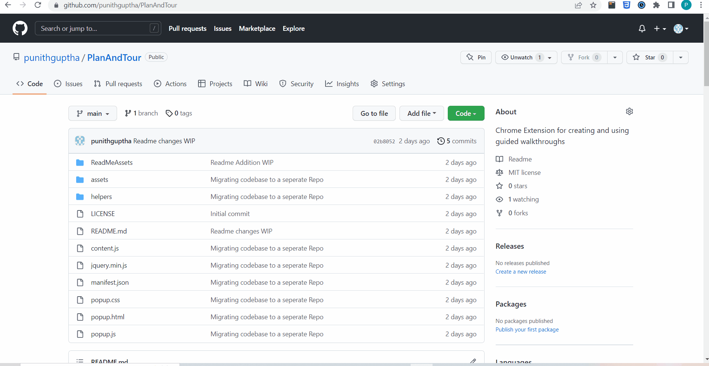
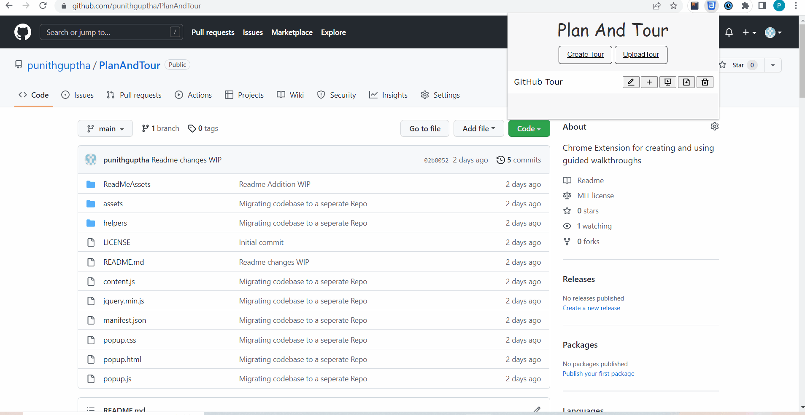
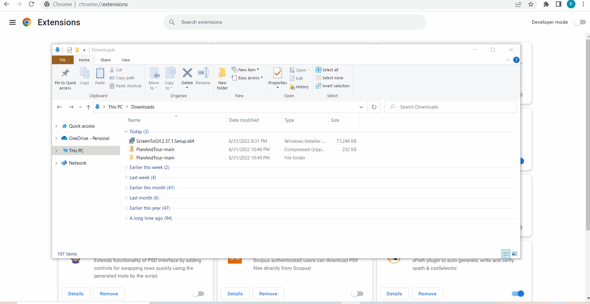

# PlanAndTour
Chrome Extension for guided walkthroughs
##   Introduction:

A chrome extension which serves as one stop solution for guided walkthroughs. Using this a user can create walkthroughs and present them for any website. Apart from these there are several functionalities built in like download, upload, delete, etc, which will be covered in detail under **Functionality and Usage** section.

##   Technologies and Libraries Used:
* Javascript
* Jquery
* sweetalert.js
* shepherd.js
* theRoom.js

    Along with the above listed, Chrome Storage API Framework was used for storing the walkthroughs

<h2><strong>Functionality and Usage:</strong></h2>

 

    

Before we start explaining on usage, one needs to understand two terms which will frequently used below, Tour and Step. A step is an individual element in the walkthrough, wheras Tour is a collection of steps. Having said that lets divide the functionality section into two parts, one of them being Tour and other being of the Step.

 * <h3><strong> Tour:</strong></h3> Each Tour has its own tour menu which contains edit,add,present,download and delete options which we discuss below.

     
    <h4><strong>1. Create:</strong></h4> This is the create tour option which is used to create a tour. During initial creation the tour will be empty without any steps in it.
    <h4><strong>2. Edit:</strong></h4> Used to Edit the Tour details (title and description of tour)
    <h4><strong>3. AddStep(s):</strong></h4> To add steps in the current Tour. When this option is clicked, an inspector styled rectangle appears on element hovered(lets call it element selector), which indicates the outline of particular element in dom, as shown below
    
     
    
    

    Upon succesful selection of element which needs to be added as step, press <strong>"Shift+S"</strong> shortcut on the keyboard, upon which you will be greeted with below menu.
    
     

    

      
    

    If you want to replace the default selector and provide custom selector for the element you can do it in the Optional Element Selector Entry in the form.

    Also, event type entry is supported but currently is limited to "click" event. If we specify <strong>click</strong> in the entry the tour moves forward on clicking the specified element unlike having next or previous menu in the default case. 

    <strong>Note:</strong> The above two discussed options can also be changed later on via the step Edit options.

    On succesful population of fields one can click on save to save the step or cancel on the top right of form to discard. If the tour has got all the required steps to be added, to discard the element selector the press the shortcut <strong>"Shift+E"</strong>, thereby ending the tour selection. A user can also add more steps to an existing tour using the same button in the tour menu.

    <h4><strong>4. Present:</strong></h4> One can view the created tour/walkthrough via clicking the present option in the Tour Menu.

    <h4><strong>5. Download:</strong></h4> Individual Tours can be downloaded seperately, by using this option. The file downloaded will be in TourName.json format.

    <h4><strong>6. Delete:</strong></h4> To delete a created tour
    <h4><strong>7. Upload:</strong></h4> To view the tour created by someone, if a user has the downloaded tour shared to him, he can use the upload option and extension automatically loads the downloaded tour. Thus the download and upload option helps in sharing the tours created by others and viewing them.

     

    

     

 * <h3><strong> Step:</strong></h3> Each step has its own step menu which contain edit, present, delete which we discuss below.
    <h4><strong>1. Edit:</strong></h4> To Edit Step Fields after creation of tour.Using this one can edit all the fields of the step form during creation , StepName, StepDescription, StepElementSelector, StepEvent
    <h4><strong>2. Present:</strong></h4> This option can be used to start the Tour from current step
    <h4><strong>3. Delete:</strong></h4> To delete particular step in the Tour
    <h4><strong>4. Reorder:</strong></h4> There is a draggable interface provided by which one can drag and drop the steps of a particular tour, and when clicked on update the order of the tour's steps will get updated.
    
     

    

## Technical Overview:

In this section I will try to give a higher level abstract on the working of the extension.

1. The extension is build using manifest version 3.0 and is using the chrome storage apis(sync versoin) to store the walkthroughs as described earlier. 
2. All the tours created by a user are stored per domain basis. For example, if a user creates a tour on <strong>github.com</strong> domain on two different urls(Eg., <strong>"github.com/abc/v1"</strong> & <strong>"github.com/abc/v2"</strong>) all the tours created on <strong>github.com</strong> will be shown in the extension when accessed from either of the urls
3. To show the walkthrough Shepherd Library is used
4. When a user clicks on present button(either from step or from tour), the data is fetched from chrome storage and then passed on to a method which generates the steps for shepherd library and starts the tour

## How To:

To use the extension , one can follow these steps:

1. Download the whole folder from git and extract it
2. Open Chrome(or any chromium based browser like edge etc)
3. Type <strong>chrome://extensions/</strong> in the url bar which takes us to extension menu
4. Enable the developer mode on the top right corner
5. On enabling the developer mode one will be greeted with three options loadunpacked, pack extension and Update
6. Click on load unpacked and select the earlier extracted folder
7. Once that is done, you can access the extension like any other from the browser, and start using it!!

     

