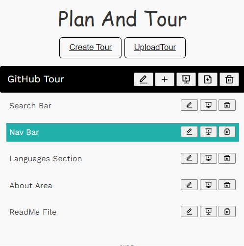
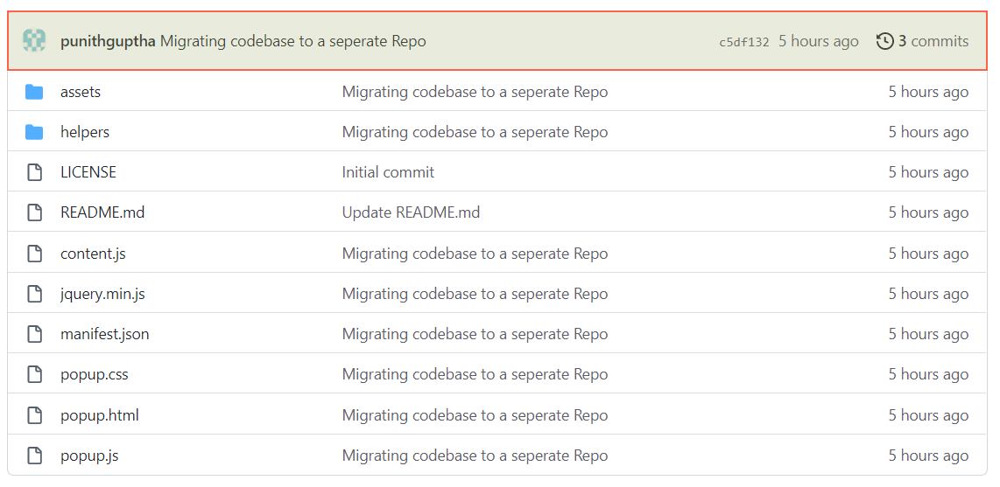
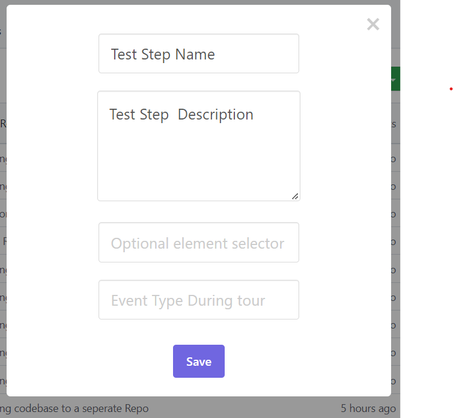

# PlanAndTour
Chrome Extension for guided walkthroughs
##   Introduction:

A chrome extension which serves as one stop solution for guided walkthroughs. Using this a user can create walkthroughs and present them for any website. Apart from these there are several functionalities built in like download, upload, delete, etc, which will be covered in detail under **Functionality and Usage** section.

##   Technologies and Libraries:
* Javascript
* Jquery
* sweetalert.js
* shepherd.js
* theRoom.js

    Along with the above listed, Chrome Storage API Framework was used for storing the walkthroughs

<h2><strong>Functionality and Usage:</strong></h2>

 

Before we start explaining on usage, one needs to understand two terms which will frequently used below, Tour and Step. A step is an individual element in the walkthrough, wheras Tour is a collection of steps. Having said that lets divide the functionality section into two parts, one of them being Tour and other being of the Step.

 * <h3><strong> Tour:</strong></h3>
    <h4><strong>1. Create:</strong></h4> This is the create tour option which is used to create a tour. During initial creation the tour will be empty without any steps in it.
    <h4><strong>2. Edit:</strong></h4> Used to Edit the Tour details (title and description of tour)
    <h4><strong>3. AddStep(s):</strong></h4> To add steps in the current Tour. When this option is clicked, an inspector styled rectangle appears on element hovered, which indicates the outline of particular element in dom, as shown below
    
     

    

    Upon succesful selection of element which needs to be added as step, press <strong>"Shift+S"</strong> shortcut on the keyboard, upon which you will be greeted with below menu.
    
     
    
   
    

    <h4><strong>4. Present:</strong></h4>
    <h4><strong>5. Download:</strong></h4>
    <h4><strong>6. Delete:</strong></h4>
    <h4><strong>7. Upload:</strong></h4>

     
 * <h3><strong> Step:</strong></h3>
    <h4><strong>1. Edit:</strong></h4>
    <h4><strong>2. Present:</strong></h4>
    <h4><strong>3. Delete:</strong></h4>
    <h4><strong>4. Reorder:</strong></h4>

## Technical Overview:

## How To: